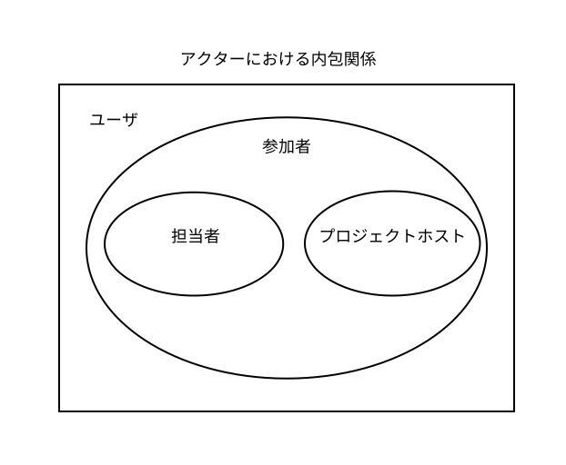

# 2020G1春課題要求仕様書

## 櫨山研究室春課題G1メンバー

◎市川晴也
近藤羽音
佐藤央
渡邊幹斗

 

## 改版履歴
***
|発行日|版数|改版内容|
|-------|----|------------------|
|2020/05/25|1.0|初版|
|2020/05/28|2.0|・目次の記述 ・1-3節　用語定義の順序変更 ・1-4節　アクターごとの機能要件についての記述 ・1-4節　タスク担当者複数可能の記述追加 ・2-2-1節　ユーザ特性の記述移動 ・2-2-1、2-2-3節　プロジェクト、タスクの文字数制限の記述追加 ・2-2-3、2-2-4節　プロジェクト、タスクを閲覧する機能の実装 ・2-5-1節　XSS対策の記述修正|
|2020/05/31|3.0|・目次の記述修正 ・1-3節　プロジェクトの記述修正、ユーザの定義削除、期日の記述追加 ・1-4節　ユーザの定義追加 ・2節　権限別による利用可能機能の表を削除、権限別による利用可能権限の図を追加 ・2-1-1節　東京学芸大学生涯メールシステムのドメインを持つという記述の削除 ・2-1-7節　実行中のプロジェクト及びタスクの遅れ発生表示を2-2-4節から移動|
|2020/06/03|4.0|★★★最後にかく！★★★|

★★★目次も最後に見直す！★★★

 

## 目次
1.はじめに

1-1.目的  
1-2.システムの概要  
1-3.用語定義  
1.4.アクター  

2.要求仕様の説明

2-1.共通機能要求

2-1-1.ユーザ登録  
2-1-2.ログイン  
2-1-3.ログアウト  
2-1-4.ユーザ情報の変更  
2-1-5.プロジェクトの作成  
2-1-6.プロジェクトの閲覧  
2-1-7.プロジェクトへの参加  
2-1-8.実行中のプロジェクト及びタスクの遅れ発生表示  

2-2.参加者の機能要求

2-2-1.プロジェクト内でのタスクの作成  
2-2-2.タスクの閲覧  

2-3.プロジェクトホストの機能要求

2-3-1.プロジェクトの情報変更  
2-3-2.プロジェクトの削除  

2-4.担当者の機能要求

2-4-1.タスクの情報変更  
2-4-2.タスクの削除  

2-5.非機能要件

2-5-1.XSS対策  
2-5-2.認証  
2-5-3.ハッシュ化  
2-5-4.ログイン情報の保持  

 

## 1.はじめに
***

### 1-1.目的
研究室でプロジェクトを行う際に使用できる共有ToDoリストの作成。

### 1-2.システムの概要
研究室でプロジェクトを行うにあたって、
「プロジェクト内の全タスクの管理」や「担当者とプロジェクトの取り組み期間などの予定の管理」をすることで、プロジェクトやタスクの管理を共有で行うことができるシステムを開発する。

### 1-3.用語定義
|用語|定義|
|-------|--------------------------|
|期日|プロジェクト及びタスクが、この時点までに完了されるべきである日付のこと。年、月、日によって構成される。|
|プロジェクト|何らかの目的を達成するための計画。タイトル、概要、プロジェクトホスト、期日、状態、参加者、0個以上のタスクより構成される。|
|タスク|プロジェクトを達成するための課題であり、プロジェクト内に作成される。タイトル、概要、担当者、期日、状態により構成される。なお、タスクの期日をプロジェクトの期日より後に設定することはできない。|
|状態|プロジェクト及びタスクの進行状態を指す。[予定, 実行中, 終了]の３つの状態がある。|

### 1-4.アクター
本システムでは、以下4種のアクターがいる。
|アクター|定義|
|-------|--------------------------|
|ユーザ|本システムにユーザ登録を行い、アカウントが発行された人。|
|参加者|ユーザのうち、プロジェクトに参加しているアクターのこと。|
|プロジェクトホスト|プロジェクトを作成したユーザがデフォルトで指定されるプロジェクトの管理者のこと。１プロジェクトにつき１人がプロジェクトホストとなる。プロジェクトに係る権限を持つ。（2-3.参照）プロジェクトホストになると、参加者権限をもつ。|
|担当者|参加者のうち、指定されたタスクを中心的にこなすべきアクターのこと。1タスクに付き1人以上の担当者が存在する。タスクに関わる権限を持つ。（2-4.参照）|

#### ※以下にアクターにおける内包関係をまとめる。

 

## 2.要求仕様の説明
***

### 2-1.共通機能要求

#### 2-1-1.ユーザ登録
ユーザはユーザ登録することでシステムを利用する権限が与えられる。
ユーザ登録にはユーザid、パスワード、氏名の項目が必要になる。項目の条件を以下に示す。
|項目|備考|
|-------|---------------------------|
|ユーザid|半角英数字8~16文字|
|パスワード|半角英数字8~16文字|
|氏名|全角半角1文字以上20字以下|

#### 2-1-2.ログイン
登録されたユーザidとパスワードの組み合わせで、システムにログインできる。

#### 2-1-3.ログアウト
ユーザはシステムからログアウトできる

#### 2-1-4.ユーザ情報の変更
ユーザはパスワードでの認証後、2-1-1節で登録したパスワード、氏名を変更できる。

#### 2-1-5.プロジェクトの作成
ユーザはプロジェクトを作成できる。タイトルは半角全角30字以内、概要は半角全角300字以内まで入力できる。プロジェクトを作成したユーザはプロジェクトホストとなる。

#### 2-1-6.実行中のプロジェクトの閲覧
ユーザは、状態が予定及び実行中のプロジェクトの情報（タイトル、概要、プロジェクトホスト、参加者、状態、期日）を閲覧することが出来る。

#### 2-1-7.終了したプロジェクトの閲覧
状態が終了になったプロジェクトは、終了したプロジェクトとして保存される。
ユーザは、終了したプロジェクトの情報（タイトル、概要、プロジェクトホスト、参加者、状態、期日）を閲覧することが出来る。

#### 2-1-8.プロジェクトへの参加
ユーザは任意のプロジェクトに参加することが出来る。参加したユーザは参加したプロジェクトの参加者となる。

#### 2-1-9.実行中のプロジェクト及びタスクの遅れ発生表示
状態が予定または実行中であるプロジェクト及びタスクには、設定した期日を過ぎた場合、”遅れ”という表示をする。

#### 2-1-10.終了したプロジェクト及びタスクの遅れ表示機能
設定された期日を過ぎて状態が終了へと移行したプロジェクト及びタスクには、”遅れて終了”という表示をする。

### 2-2.参加者の機能要求
以下に、アクター”参加者”が実行可能な機能要求を示す。

#### 2-2-1.プロジェクト内でのタスクの作成
参加者は、プロジェクト内にタスクを作成できる。タイトルは半角全角30字以内、概要は半角全角400字以内まで入力できる。タスクを作成したユーザはタスクの担当者となる。

#### 2-2-2.タスクの閲覧
参加者は、タスクの情報（タイトル、概要、担当者、期日(年月日)、状態）を閲覧することが出来る。

### 2-3.プロジェクトホストの機能要求
以下に、アクター”プロジェクトホスト”が実行可能な機能要求を示す。

#### 2-3-1.プロジェクトの情報変更
プロジェクトホストはプロジェクトの情報（タイトル、概要、プロジェクトホスト、参加者、状態、期日）を変更することが出来る。プロジェクトホストの変更は、プロジェクトホストがプロジェクトの参加者から指定することで即座に権限保持者を変更できる。プロジェクトホストを変更した場合、もとのプロジェクトホストは参加者となる。

#### 2-3-2.プロジェクトの削除
プロジェクトホストはプロジェクトを削除することが出来る。プロジェクトを削除した場合、プロジェクト下に存在するタスクも全て削除される。

### 2-4.担当者の機能要求
以下に、アクター”担当者”が実行可能な機能要求を示す。

#### 2-4-1.タスクの情報変更
担当者はタスクの情報（タイトル、概要、担当者、期日(年月日)、状態）を変更することが出来る。
担当者の変更は、担当者がプロジェクトの参加者から指定することで即座に変更できる。また、任意のユーザを担当者に追加することにより、担当者を複数人へと変更することも可能である。ただし担当者を0名にする変更は不可とする。

#### 2-4-2.タスクの削除
担当者はタスクを削除することができる。

 

#### ※権限別による利用可能機能
以下に、権限別による利用可能機能をまとめる。
|権限 \ 利用可能機能|プロジェクト内でのタスクの作成|プロジェクトの閲覧|タスクの閲覧|プロジェクトの情報変更|プロジェクトの削除|タスクの情報変更|タスクの削除|
|---|---|---|---|---|---|---|---|
|ユーザ|〇|〇|×|×|×|×|×|
|参加者|〇|〇|〇|×|×|×|×|
|プロジェクトホスト|〇|〇|〇|〇|〇|×|×|
|担当者|〇|〇|〇|×|×|〇|〇|

 

### 2-5.非機能要件

#### 2-5-1.XSS対策
スクリプトの埋め込み及びSQLインジェクション防止のため、サニタイジングを行う。また、プロジェクトのタイトルと概要、タスクのタイトルと概要に文字数制限を設けることでも、スクリプトの埋め込みとSQLインジェクションを防止する。

#### 2-5-2.認証
パスワード及びユーザidでのユーザ認証を行うことでユーザのみが本システムのウェブページを閲覧できるようにする。

#### 2-5-3.ハッシュ化
パスワードはハッシュ化する。

#### 2-5-4.ログイン情報の保持
ユーザがログイン処理をした際、HttpSessionによるセッション保存処理を施し、ログイン後24時間が経過した際に当該セッション情報を破棄する
